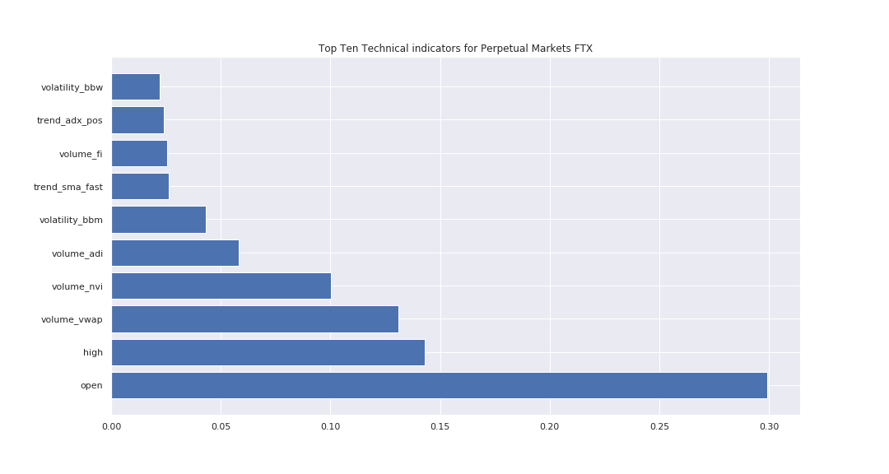

# FTX Indicator Series
## Running learning

```
git clone https://github.com/8ball030/indicator_part_2.git
```

 
## Paper

Technical Indicators  - Part 2

Introduction
Our previous article on the selection of technical indicators saw an investigation into the information conveyed in a large number of traditional financial technical indicators. We performed an analysis of the markets involved in FTX’s trading DeFi trading competition to determine the indicators which convey the most information at each timestep.

By employing a machine learning algorithm to predict the next time step in the series, we were able to use the technical indicators as factors in this prediction problem. We were then able to isolate the impact of each of the individual indicators in order to rank their impact on the models ability to correctly predict the next time step.

We were able to show that for the vast majority of the technical indicators, their inclusion into our model did not increase our predictive capability. It also allowed us to identify the most relevant indicators as so;



The next issue becomes, how do we capitalise on this knowledge?

A more traditional approach to the problem would be to create a rule-based system. Using a rule-based approach, the architect would specify individual combinations of ***if*** is True ***then*** actions.

This will feel intuitive to most readers. This is exactly how the very first thinknig machines where programmed. These rule-based systems would then be backtested against historic market data in order to optimise the performance of the system by modifying the conditions of the rules within the rule set.

However, this approach has a number of drawbacks.
 - Requires an approach to assigning buy and sell signals to the different combinations of possible factors.
 - Can require a large number of rules to cover every outcome

Consider a simple buy the dip strategy consisting of a number of rules:
#### Entry
 - ***if*** market drops **a** percent
-- **then** buying with ***b*** percent of your cash

#### Exit - Profit
 - ***if*** market rises **c** percent
-- **then** selling ***d*** percent of your btc

#### Exit - Stoploss
 - ***if*** market drops **e** percent
-- **then** selling ***f*** percent of your btc

On the surface, this looks like an easy problem to just brute force.

However, our possible total number of permutations of possible combinations of paramters is given by;


If we are to use a conservative estimate of only 5 possible numbers for each of our 6 parameters, we have a total of 15625 possible permutations just for this simple rule set. If we increase the solution space by allowing for more granular numbers, i.e. 50 possible numbers rather than 5 we see an increase in the solution space to 15625000000. 

It is clear that more traditional forms of computing will not necessarily help us achieve our desired outcome of outperforming the market, the solution space is too large, and the difficulty in implementing enough rules to cover every possible case is impractical.

## Traditional Machine Learning

In traditional Machine Learning, the main approaches are Supervised Learning, where we have labeled data to use for training. This is the approach that is most known and seen in the real world. Common applications of this approach are for classification. In recent years there has been a huge shift forward in the technology used to actually perform this classification beginning with the success of AlexNet in the 2012 challenges hosted by Google (Krizhevsky et al 2017).

This approach used a neural network based on the human brain to classify images that allowed it to exceed human level performance in a number of common image classification tasks, and in the passing decade, the technology has improved considerably. 

Unsupervised Machine Learning is the other traditional branch of Machine Learning, it is primarily concerned with finding association vast datasets. The intuition behind Unsupervised Machine Learning is that the architect is able to present the algorithm the data and the algorithm will identify patterns in the data that would be impossible to discern using traditional methods. The technology is most commonly known to be used in recommendation systems, i.e. the product recommendation engine used by Amazon is an example of this type of Machine Learning.

We could apply either of these traditional approaches to the time-series data that we have collected for the market. For example, we could use Supervised Machine Learning along with our pre-selected indicators to go ahead and predict the direction of the market over the next time step. 

Alternatively, we could go ahead and use Unsupervised Learning to categorise periods of the market into different categories based on relationships between the technical indicators we would be unable to identify without considerable computational cost. We could then identify the Bull Cycle and Bear Cycle for different asset pairs. We would then place our trades accordingly.

However, it is clear that even if we were to provide a signal to our trading decisions, we would still be missing a vital component required to fully automate the system. 

Speak to any experienced trader, one of the most important things about success in the trading area is behaviour, not just picking the right moves, but knowing what to do when it goes wrong. Discipline, and sticking to your system is vital to survival as a trader.

    "The whole secret to winning and losing in the stock market is to lose the least amount possible when you're not right."
*William J. O'Neil*


To fully capitalise on the information gained from the indicators we have selected, it would still be necessary to create a number of rules to manage exposure, position size, and existing orders. All of these interacting rules opens up the possibility of unintended consequences, or would require considerable testing to cover every conceivable situation.

Therefore, we are looking for a different approach to exploring the solution space. Due to the fact that our actions within the environment have a direct impact upon our performance within the environment, the problem does not fit into the traditional domains for which machine learning is best known for. 

### Reinforcement Learning
Reinforcement Learning is a more modern approach to decision making in incomplete non-deterministic environments. The technique sprung to fame emerged into the forefront of decision making computer science with the performance of the AI  Go playing algorithm developed by Deep Mind AlphaGo.

AlphaGo played South Korean professional Go player Lee Sedol, one of the best players at Go with five games. Out of five games, AlphaGo won four games and Lee won the fourth game which made him recorded as the only human player who beat AlphaGo in all of its 74 official games (Sung-won, 2016).

This achievement was revolutionary for the field, and in the passing time, the technology has been applied with startling results in a number of fields from playing Super Mario on Nintendo, through to performing stunts in remote controlled planes. 

What makes this form of learning so interesting is that the algorithms are able to map actions from many time steps in the past to rewards achieved in the present time step. Additionally the algorithm is capable of reacting to new information and updating its model to account for the new information.

The core concept underlying Reinforcement Learning is that the algorithms are designed to perform actions on a modelled environment constructed to match the real world as much as possible. The algorithm will then take an action on that environment and then depending upon the action, the agent will then either receive a reward or not receive a reward. 

At each step, the agent will predict which action will deliver the most expected long term reward, the results of the action are then used by the agent to update its expected reward with the reward actually received. Continued iterations of this process lead to the agent learning which actions will maximise its expected long term reward.

This form of Machine Learning has already been applied to trading by a number of different authors with very promising results, (Dempster, Leemans (2006)) &  (Weng et al, (2020)).


## Experiments

Continuing with our datasets gathered from the previous article, we will use the TensorTrader library to implement our trading agent. 

We will train our reinforcment learning algorithm on 2000 1 hour candles sticks from 2020-10-07 17:00:00 until 2020-12-30 00:00:00.
We will augment these candlesticks with the indicators which we selected in our previous set of experiments to create a vector consisting of not only these technical indicators, but also the actual internal state of the agent(cash balance, btc balance).

We will then implement a Reinforcement Learning algorithm which as its reward measure receives the simple profit and loss of the agent through its current iteration. 

This metric means that our algorithm will optimise the actions of the agent in order to maximise profit, with no regard for risk.

Results

Conclusion

There are a number of different performance measures we would use in order to change the behaviour of our agent, depending upon our personal risk tolerance, these will be covered in the next article as we discuss the real world performance of our agent.


# References

[Github Repo] (https://github.com/8ball030/ftx_competition_entry)

[CCXT](https://github.com/ccxt/ccxt) 

[PyAlgoTrade](https://gbeced.github.io/pyalgotrade/)


Krizhevsky, Alex; Sutskever, Ilya; Hinton, Geoffrey E. (June 2017). "ImageNet classification with deep convolutional neural networks" (PDF). Communications of the ACM. 60 (6): 84–90. doi:10.1145/3065386. ISSN 0001-0782. S2CID 195908774. Retrieved 24 May 2017.

Yoon Sung-won (14 March 2016). "Lee Se-dol shows AlphaGo beatable". The Korea Times. Retrieved 15 March 2016.

M.A.H. Dempster, V. Leemans,
An automated FX trading system using adaptive reinforcement learning,
Expert Systems with Applications,
Volume 30, Issue 3,
2006,
Pages 543-552,
ISSN 0957-4174,
https://doi.org/10.1016/j.eswa.2005.10.012.
(http://www.sciencedirect.com/science/article/pii/S0957417405003015)
Abstract: This paper introduces adaptive reinforcement learning (ARL) as the basis for a fully automated trading system application. The system is designed to trade foreign exchange (FX) markets and relies on a layered structure consisting of a machine learning algorithm, a risk management overlay and a dynamic utility optimization layer. An existing machine-learning method called recurrent reinforcement learning (RRL) was chosen as the underlying algorithm for ARL. One of the strengths of our approach is that the dynamic optimization layer makes a fixed choice of model tuning parameters unnecessary. It also allows for a risk-return trade-off to be made by the user within the system. The trading system is able to make consistent gains out-of-sample while avoiding large draw-downs.

Liguo Weng, Xudong Sun, Min Xia, Jia Liu, Yiqing Xu,
Portfolio trading system of digital currencies: A deep reinforcement learning with multidimensional attention gating mechanism,
Neurocomputing,
Volume 402,
2020,
Pages 171-182,
ISSN 0925-2312,
https://doi.org/10.1016/j.neucom.2020.04.004.
(http://www.sciencedirect.com/science/article/pii/S0925231220305427)
Abstract: As a hot topic in the financial engineering, the portfolio optimization aims to increase investors’ wealth. In this paper, a portfolio management system based on deep-reinforcement learning is proposed. In contrast to inflexible traditional methods, the proposed system achieves a better trading strategy through Reinforcement learning. The reward signal of Reinforcement learning is updated by action weights from Deep learning networks. Low price, high price and close price constitute the inputs, but the importance of these three features is quite different. Traditional methods and the classical CNN can’t deal with these three features separately, but in our method, a designed depth convolution is proposed to deal with these three features separately. In a virtual currency market, the price rise only occurs in a flash. Traditional methods and CNN networks can’t accurately judge the critical time. In order to solve this problem, a three-dimensional attention gating network is proposed and it gives higher weights on rising moments and assets. Under different market conditions, the proposed system achieves more substantial returns and greatly improves the Sharpe ratios. The short-term risk index of the proposed system is lower than those of the traditional algorithms. Simulation results show that the traditional algorithms (including Best, CRP, PAMR, CWMR and CNN) are unable to perform as well as our approach.
Keywords: Portfolio; Deep-reinforcement learning; Reinforcement learning; Attention gating mechanism


## Referals & Tips
Shameless plug of FTX exchange, the only exchange I trade on.

[FTX Exchange](https://ftx.com/#a=2746848)

BTC:
37fRtmuJTLR8QZtKWwyHh7d5AWiv4Xoz8G

BCH:
0xec34CD3ABDEBC781647083AF3d2fafADacb35D63

[Brave Support](https://brave.com/bal844)


